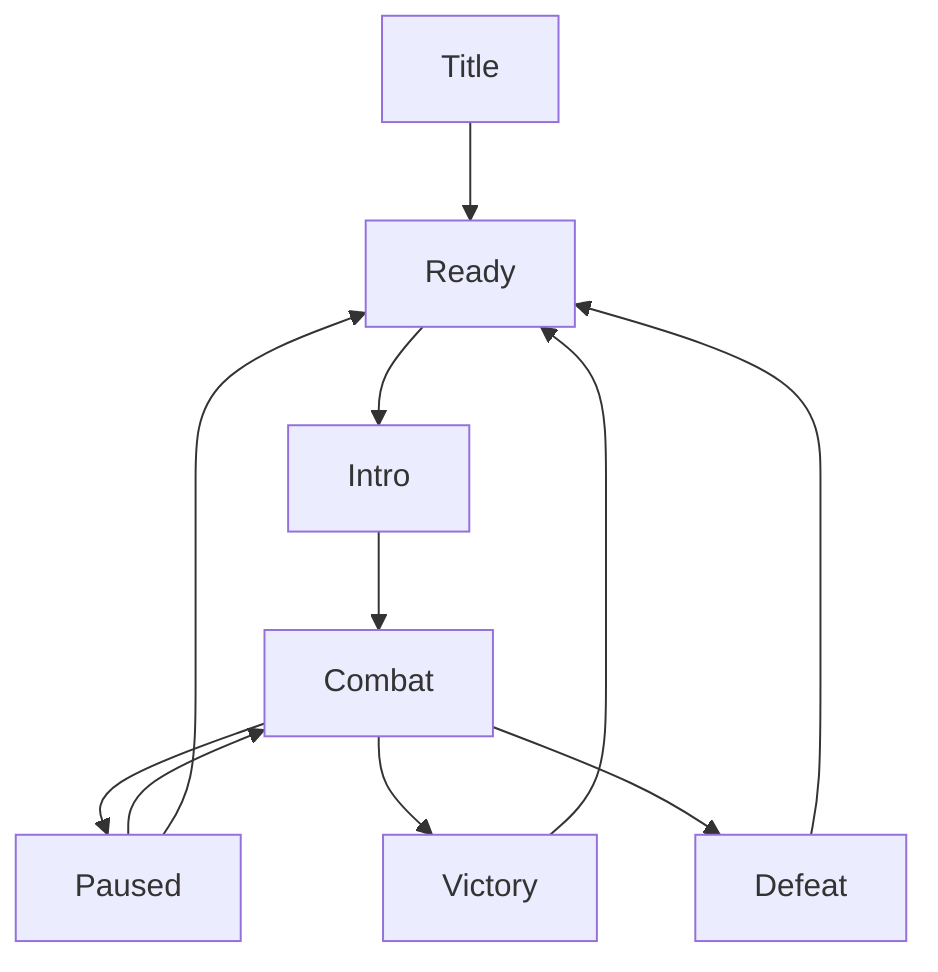

# Phase 1 Proposal: The Hollow Warden

**Course:** SWE402 - Game Development  
**Project:** One playable 2D boss encounter (vertical slice)  
**Date:** 27 September 2026

**Team members:**

- Ayman Al Johani - 202016260
- Mohammed Alajmi - 202065020

## 1. Scene summary and player journey

We are building one self-contained 2D boss encounter in a ruined cathedral. The player fights the Hollow Warden, a spear-wielding guardian, inside one sealed arena. We want the fight to be challenging, but the player should understand what went wrong when they lose. We are aiming for a successful attempt to last around 3-6 minutes.

Since there are only two of us, we will focus on two boss phases and three attacks. We are keeping the cathedral setting and the main combat idea, but leaving extra abilities and advanced effects until the basic fight works well.

### Boundaries

- **Start trigger:** the player crosses the entrance trigger from a small safe area within the same scene. The door closes, the boss introduction plays once, and combat begins.
- **Playable space:** one arena with a flat floor and solid walls; the cathedral background is decorative.
- **Player goal:** reduce the boss's health to zero while keeping at least one health point.
- **Success:** boss health reaches zero while the player is alive. Attacks stop, the exit opens, and a victory overlay offers replay or return to the title screen. No second level follows.
- **Failure:** player health reaches zero. Combat stops and a retry prompt appears. Retry restores both characters, clears projectiles and returns the player to the entrance, with a target of under 10 seconds from selecting retry to regaining control.
- **Simultaneous lethal damage:** defeat takes priority, avoiding conflicting victory and defeat screens.

### Player journey

The player starts at the title screen, enters the safe area and sees the controls. Crossing the doorway starts the encounter. Phase 1 introduces the attack timings. Phase 2 adds an aerial attack and shorter recovery windows. The attempt ends in victory or defeat; a retry resets the entire encounter rather than preserving damage or resources.

### Core loop

1. Read the boss's visual and audio warning.
2. Jump, dash or reposition to avoid the attack.
3. Move into range and strike during recovery.
4. Build Focus by landing successful hits.
5. Decide whether to spend a safe opening attacking or healing.
6. Repeat with tighter timing in Phase 2.

## 2. Reference scene

**Target game:** Hollow Knight, by Team Cherry.  
**Target scene:** Hornet Protector encounter in Greenpath.  
**Video:** [How to Beat Hornet Protector | Hollow Knight | Boss Blitz](https://www.youtube.com/watch?v=3od8GpfeD0A). Use the Greenpath fight segment, which the video listing labels at 00:00; exclude travel and unrelated encounters.

We use this scene as a reference for combat readability, attack recovery and a bounded boss encounter. We are not attempting to reproduce the whole game. Our dash, double jump and phase thresholds are design choices for our version, rather than an exact copy of the reference fight.

| System to study | What we aim to reproduce | Our simplification or change | Technical reason |
| --- | --- | --- | --- |
| Movement and spacing | Responsive movement and meaningful positioning during a duel | Run, jump, double jump and a short dash in a flat arena | A compact moveset can be tested thoroughly by two people |
| Melee and recovery | Short attack opportunities after an enemy commits to an action | One horizontal melee attack; no directional combo or pogo system | Reduces animation and hit-detection combinations |
| Enemy behaviour | Clearly signalled attacks followed by recovery | Three attacks controlled by a finite state machine; two custom phases | Keeps AI transitions and fairness checks manageable |
| Collision and damage | Understandable contact, attacks and knockback | Separate attack hitboxes and damage-receiving hurtboxes; no destructible environment | Separates movement collision from damage rules |
| Camera and arena | Keep both combatants and warning cues readable | Fixed arena camera with a small, optional shake | Avoids camera tracking hiding an incoming attack |
| HUD and feedback | Immediate feedback when health or resources change | Player health, Focus, visible boss health bar and simple outcome overlays | Makes state and debugging visible without a large menu system |
| Art and audio | Strong silhouettes, attack cues and impact feedback | One cohesive asset set, limited animations, one looping music track and event-based SFX | Prioritises a finished encounter over expensive custom content |

We create our own encounter logic and use original or appropriately licensed visual/audio assets. Asset sources and licences are recorded in `docs/credits.md`; we do not extract assets from Hollow Knight.

## 3. Scope

### Must-have

- One arena and one boss with two phases and three attacks.
- Keyboard controls: movement, jump, double jump, dash, melee and Focus heal.
- Player/boss health, damage cooldowns, knockback and complete win/lose/retry flow.
- Reliable collision, attack warnings and safe attack recovery windows.
- Title screen, control prompts, HUD, pause/resume, restart and victory/defeat overlays.
- Readable sprites, basic animations, hit flash, small particle effects and bounded camera.
- Music, attack warnings, hit sounds and separate music/SFX volume controls.
- Windows desktop build, playtesting notes and before/after profiling evidence.
- GitHub issues, Project board, reviewed changes, milestones and short documentation.

### Nice-to-have

- Spirit Bolt ranged attack using the same Focus resource.
- Gamepad support and control remapping.
- Third boss phase with an additional attack, only after all core acceptance criteria pass.
- Decorative animated water, sprite normal maps and additional parallax layers.
- Adaptive music, detailed results statistics and extra camera effects.

These features are not dependencies of the required combat loop. We consider at most one stretch feature after the core build is stable, and none during the final release week.

### Explicitly NOT doing

- A full metroidvania, exploration map or multiple playable levels.
- Additional bosses, ordinary enemy types or multiplayer.
- Inventory, equipment, skill trees, progression or a persistent save system.
- Pogo combat, wall climbing, directional attack combinations or destructible scenery.
- Long story cutscenes, voice acting, localisation or console/mobile releases.
- Gameplay-changing flooding or a custom fluid simulation.

**If we fall behind:** we will drop optional features first, then simplify the art and effects. We will protect the two-phase fight, three attacks, damage rules and retry flow. If those also need to change, we will discuss it with the instructor and update the proposal.

## 4. How we will build it

### 4.1 Core gameplay systems engineering

We plan to use Unity 6 with C# and URP's 2D Renderer. Both members use the same exact Editor and package versions, recorded in the README after setup. The initial delivery target is a Windows desktop build.

| Action | Initial keyboard binding | Planned behaviour |
| --- | --- | --- |
| Move | A/D or left/right arrows | Horizontal movement with collision against arena walls |
| Jump | Space | Variable height; approximately 0.1 s coyote time and 0.12 s input buffer |
| Double jump | Space while airborne | One additional jump, reset only on landing |
| Dash | Left Shift | 0.2 s horizontal dash, 0.12 s invulnerability and 0.6 s cooldown |
| Melee | J | One forward strike, 1 damage, approximately 0.35 s between attacks |
| Heal | K, held | Stand still for 1 s, spend 3 Focus and recover 1 health; interrupted by damage |
| Pause | Escape | Suspend combat and show resume/restart/audio options |

All values are initial tuning assumptions. Player health starts at 5, Focus ranges from 0 to 9, and each successful melee hit adds 1 Focus. Healing is unavailable at full health or with insufficient Focus. Focus is deducted only when healing completes. All boss attacks initially deal 1 damage.

A central `GameStateManager` owns title, ready, introduction, combat, pause, victory and defeat states. Gameplay input is disabled outside ready/combat, while menu input remains available. Restart restores time scale, health, Focus, cooldowns, boss phase, doors and pooled objects.

### 4.2 Physics and collision systems

We use 2D colliders for the arena and separate collision layers for the world, player, boss and attacks. Input is captured each frame; physics movement is applied on a fixed timestep. A fixed timestep supports consistent testing but is not a promise of identical physics across every machine.

Each attack instance records which target it has already damaged so overlapping colliders do not apply multiple hits. The player receives a short post-hit invulnerability window; dash invulnerability and damage cooldowns are checked by the same damage receiver. Hitboxes are active only during an attack's active state. For fast spear movement, a cast between the previous and next position checks for missed collisions.

Checks include dashing into walls, landing near corners, overlapping hitboxes, taking a hit during healing, pausing mid-attack and retrying while a projectile exists. The boss is bounded to the arena and cannot attack through its walls.

### 4.3 AI behaviour design

The Warden starts with 60 HP. Phase 1 is above 30 HP; Phase 2 begins at 30 HP or below. Crossing the threshold queues one transition at the end of the current attack; death interrupts immediately. A brief transition cue gives the player time to recognise the change.

| Attack | Warning | Active behaviour | Avoidance and recovery |
| --- | --- | --- | --- |
| Lunge | Crouch/spear pose and sound, initially 0.6 s | Dash horizontally toward the player's recorded position | Jump or dash away; boss pauses for approximately 0.7 s afterwards |
| Spear throw | Raised spear and distinct audio cue | Throw one spear outward and return it to the boss | Reposition or jump; recovery occurs after the spear returns |
| Aerial dive, Phase 2 only | Jump and visible landing marker | Commit to the player's recorded ground position | Move away from the marker; clear landing recovery window |

The finite state machine uses Intro, Idle, SelectAttack, Telegraph, Active, Recovery, PhaseTransition and Dead. Distance filters unsuitable attacks, then weighted selection chooses among valid options. An attack cannot repeat more than twice consecutively. Phase 2 slightly shortens recovery; it does not remove warnings or create unavoidable overlapping attacks. A fixed random seed is available for reproducing bugs in development.

### 4.4 Real-time graphics pipeline

We use a cohesive 2D sprite style, explicit sorting layers and a limited cathedral background. A global 2D light plus a small number of accent lights provides atmosphere. The player, boss and warning markers remain brighter or more distinct than decoration. Decorative water does not affect collisions. Advanced water shaders and normal maps remain optional.

### 4.5 Technical art and polish

The required animation set covers player idle, run, jump, dash, strike, heal, hurt and death; the boss has warning, active and recovery poses for each attack, plus transition and death. We can use limited sprite frames and simple transforms where full custom animation is too expensive.

Damage events trigger a brief sprite flash, hit particles and optional restrained camera shake. A fixed camera frames the full fighting area. Light colour grading supports the scene, while strong bloom and distortion are avoided if they obscure warnings. Flash and shake can be reduced in settings. Animation visuals follow combat state; they must not keep damaging hitboxes active after an attack ends.

### 4.6 Audio systems design

The baseline is one licensed looping music track, quiet cathedral ambience, movement/attack sounds, separate warning sounds for each boss attack and victory/defeat cues. Mixer groups separate music, SFX and UI. Volume sliders act on the mixer rather than modifying every sound individually.

World sounds may use mild stereo panning by screen position; full 3D spatial audio is unnecessary for this fixed 2D view. Warning cues remain audible over music. Pause suspends gameplay sounds, and retry prevents duplicate music loops. Adaptive layered music is optional.

### 4.7 UI/UX feedback and integration

The HUD displays five player health units, Focus and boss health. Controls appear in the safe area. Low health, insufficient Focus, boss phase change and outcome states use distinct feedback; essential information is not conveyed by colour alone.

The systems connect through a small set of events. For example, when a melee hit lands, the damage receiver updates health and sends a damage event. The HUD updates its health display, while the audio and effects scripts play the hit feedback. Boss health also controls phase changes and death. Keeping those jobs separate should make it easier for us to work on different parts without breaking each other's code.

### 4.8 Performance optimization and debugging

We target 60 FPS at 1920 x 1080 on a team laptop selected and documented during setup, including CPU, GPU and RAM. The provisional frame budget is 16.7 ms. We capture at least 60 seconds of active combat in a development build using the Unity Profiler, recording frame-time spikes, CPU work, memory and recurring allocations. GPU timing is recorded where supported. Final playability is also checked in a non-development build.

Projectiles and repeated effects are pooled, particle counts are capped, and active lights are limited. We first measure a bottleneck, then make one relevant change and retain comparable before/after captures. We also run ten consecutive restarts and check for duplicated events, lingering projectiles, growing object counts and Console errors. If the target is missed, reduce optional effects and document remaining limits rather than claim unmeasured performance.

### 4.9 Working together

Repository: [Ayman818/SWE402-Game-Project](https://github.com/Ayman818/SWE402-Game-Project). The proposal lives at `docs/phase1/proposal.md`.

We use short feature branches such as `feature/player-controller` and `feature/boss-ai`. Each change links to an issue, includes test notes and is reviewed by the other member before merging into `main`. The main branch should remain playable. Unity `.meta` files are committed; generated folders such as Library and Temp are excluded with a Unity `.gitignore`. Large binary assets use Git LFS where appropriate.

We keep player and boss work in separate prefabs and avoid simultaneous edits to the main scene. The scene integrator coordinates scene changes. A brief weekly meeting reviews the board, blockers and the next playable build. Decisions, bugs and playtest results are written down rather than kept only in chat.

## 5. Roles and ownership

This is our proposed task split. We will confirm it together before starting, and help each other when a task takes longer than expected. The person who does not own a task reviews it.

| Member | Primary ownership | Integration responsibilities |
| --- | --- | --- |
| Ayman Al Johani | Player movement/combat, collision and damage framework, game-state flow, HUD and menus | Repository/board setup, build packaging, performance captures and restart stability |
| Mohammed Alajmi | Boss FSM and attacks, arena layout, sprite/animation integration, VFX and audio | Main-scene integration, attack readability and asset/credit records |
| Both | Scope decisions, balancing, playtesting, reviews and documentation | Weekly playable build review and final acceptance checks |

## 6. GitHub Project board and actionable tasks

Create one board named **The Hollow Warden - Production**, linked to the repository. Planned columns are **Backlog, Ready, In Progress, Review, Done**. Each issue contains an owner, milestone, priority, estimate, dependencies and acceptance checklist. Use labels `gameplay`, `ai`, `art`, `audio`, `ui`, `bug` and `documentation`. Each member keeps at most one main implementation issue In Progress.

We will create the board and issues from the task list below.

| ID | Actionable task | Owner | Depends on | Acceptance criteria | Target |
| --- | --- | --- | --- | --- | --- |
| T01 | Set up Unity project, Git ignore, README, board and build target | Ayman | None | Both members open the same project version and run a blank Windows build; test machine recorded | Week 1 |
| T02 | Build greybox arena and entrance trigger | Mohammed | T01 | Floor/walls block movement; crossing doorway seals arena once | Week 1 |
| T03 | Implement movement, jump, double jump and dash | Ayman | T01, T02 | Inputs work; extra jump resets only on landing; dash cannot pass through walls | Week 2 |
| T04 | Add health, melee and shared damage rules | Ayman | T03 | One attack damages a target once; invulnerability and lethal damage behave consistently | Week 2 |
| T05 | Implement boss FSM and lunge | Mohammed | T02; T04 for integration | Warning/active/recovery states are observable; lunge remains inside arena and can be avoided | Week 2 |
| T06 | Add spear throw and phase transition | Mohammed | T04, T05 | Spear returns/clears correctly; crossing 30 HP triggers one phase transition | Week 3 |
| T07 | Add Focus heal, outcome flow and complete retry | Ayman | T04, T05 | Healing follows resource rules; victory/defeat are exclusive; retry resets all encounter state | Week 3 |
| T08 | Implement aerial dive and balance attack selection | Mohammed | T06 | Dive locks a landing position, shows a warning and leaves a punish window; repeat limit works | Week 4 |
| T09 | Build HUD, prompts, pause and volume controls | Ayman | T07 | HUD matches state; menus work by keyboard; pause freezes combat and restart resumes normally | Weeks 4-5 |
| T10 | Integrate sprites, animation and restrained effects | Mohammed | T08 | All required actions have visible feedback; warnings remain readable over background/effects | Weeks 5-6 |
| T11 | Integrate music, warning cues and credits | Mohammed | T09, T10 | Each attack has an audible cue; volume controls work; no duplicated loops; credits complete | Week 6 |
| T12 | Profile build and fix collision/restart defects | Ayman | T08-T11 | Performance evidence saved; ten restarts pass; no blocking errors remain | Week 7 |
| T13 | Run external playtests and adjust encounter | Mohammed | T12 | At least three testers try the build; observations and resulting changes recorded | Week 7 |
| T14 | Package final build and verify documentation | Ayman | T12, T13 | Clean launch-to-win/lose/retry flow verified by both members; release tagged and instructions complete | Week 8 |

**When a task is done:** its checklist passes, the other member has reviewed it, and we have tried it in a playable build without new blocking errors. We also update any instructions affected by the change.

## 7. Milestones and Phase 2 checkpoint

This schedule uses eight working weeks after proposal approval, assuming approximately six hours per member per week (about 96 person-hours total). These are planning assumptions, not official course dates; we map them to instructor deadlines when confirmed. Optional work is excluded from that baseline.

| Milestone | Timing | Deliverable |
| --- | --- | --- |
| Setup and greybox | Week 1 | Shared project, board, arena, controls plan and test-machine record |
| Phase 2 internal checkpoint | End of Week 3, or earlier if required by the course | Playable prototype with movement, combat, two attacks, phase transition and full outcome/retry flow |
| Feature complete | End of Week 5 | Three attacks, two phases, Focus heal, HUD, pause and audio controls |
| Presentation pass | End of Week 6 | Cohesive sprites, animations, VFX and audio integrated |
| Validation and release | Weeks 7-8 | Playtests, profiling fixes, final build and documentation; no new systems |

### Phase 2 checkpoint acceptance bullets

- Both teammates can clone/open the project using documented versions.
- A greybox arena has a functioning entrance trigger and sealed combat boundary.
- Movement, jump, double jump, dash and melee work with solid collisions.
- The boss performs lunge and spear throw through warning, active and recovery states.
- Crossing the phase threshold produces a visible transition; final Phase 2 attack polish is not required yet.
- Health and Focus update correctly; healing can complete or be interrupted.
- Victory, defeat, pause and retry can be demonstrated in a desktop build.
- Retry clears projectiles and restores health, Focus, cooldowns and boss phase.
- One initial profiler capture and known-bug list are stored with the checkpoint notes.
- The Project board shows completed tasks, remaining work and named owners.
- A short gameplay recording and build instructions support review of the checkpoint.

We will also check the instructor's Phase 2 instructions and adjust this checkpoint if needed.

## 8. Risks and mitigation

| Risk | Early warning or check | Mitigation and fallback | Owner |
| --- | --- | --- | --- |
| Too much work for two developers | Core issues exceed weekly capacity or slip by one week | Stop optional work; use licensed assets and simpler effects; review scope weekly | Both |
| Unfair or unreliable damage | Testers report hits after warnings end, double damage or wall penetration | Show debug hitboxes, use per-attack hit tracking and record reproducible cases before tuning difficulty | Ayman |
| Boss FSM gets stuck | An attack never recovers or phase change interrupts damage cleanup | Centralise state exit cleanup; add development state logs and repeated transition tests | Mohammed |
| Art/animation takes too long | Missing required sprites by Week 5 | Use one consistent licensed set and limited-frame poses; keep visual cues clear | Mohammed |
| Scene merge conflicts | Both members need to change the same scene | Keep work in prefabs; Mohammed coordinates main-scene integration; merge small changes frequently | Both |
| Performance misses target | Profiler reveals recurring spikes or effects dominate frame time | Pool repeated objects, cap particles/lights and remove optional visual layers; retain evidence | Ayman |
| Retry leaves stale state | Projectiles, callbacks or music survive restarts | Centralised reset routine and ten consecutive restart checks before release | Ayman |
| Asset licence is unclear | An asset has no identifiable reuse terms | Replace it with a documented original or licensed alternative before integration | Mohammed |

## 9. Playtesting and final delivery

We ask at least three players outside the team to attempt the encounter. We record attempt count, approximate clear time, confusing attacks and control/feedback comments. The aim is an understandable challenge, not a guaranteed number of attempts. At least two testers should be able to explain how to avoid each attack after practising; repeated confusion triggers a warning/timing revision.

At the end, we will provide the source repository, Windows build, instructions, credits, playtest notes and profiler captures. Both of us will check starting the game, winning, losing, pausing and retrying. We will list any remaining issues in the README. Our priority is to finish one good encounter that works from start to end.
